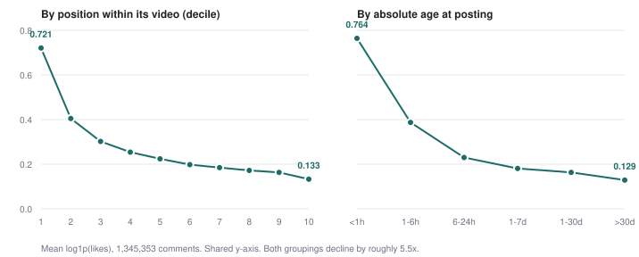

# YouTube Comment Exposure: 1.35M comments with post timestamps

## Abstract

Public YouTube comment corpora carry like counts without the time each comment was
posted. That omission is load-bearing rather than incidental: a comment posted in a
video's first hour is seen by orders of magnitude more people than one posted a week
later, so a like count read without a timestamp confounds what a comment said with when
it arrived. Models trained on those corpora fit the head start with no way to see it.

This corpus records what was missing. 1,345,353 top-level comments from 633
fully-enumerated videos across 34 channels, with post time, fetch time, reply count,
video statistics, and the position YouTube's own ranking gave each comment.

Two analyses show what the timestamps buy. Decomposing what orders a comment's likes,
**exposure accounts for 83.5% of the ordering skill available above chance**, against
8.2% for what the comment says (16.5% if comment length counts as content rather than
exposure). Auditing a retrieval-based engagement estimator of the kind used to certify
comment generators, it orders real comments at Spearman 0.050 where an exposure-only
model reaches 0.19, and its headline ratio reverses direction depending on whether you
summarise with a mean or a median.

## What existing corpora leave out

The two large public YouTube comment datasets, YT-30M [@yt30m] and YTCommentVerse
[@ytcommentverse], hold roughly 32 million comments between them. Both provide `upvotes`. Neither provides a timestamp or a
reply count.

For sentiment work or language modelling that omission costs little. For anything that
treats a like count as a measure of the comment, it is disqualifying. YouTube's "Top
comments" ranking compounds an early advantage: being ranked high causes likes, and likes
cause being ranked high. Two comments of identical quality can differ by three orders of
magnitude in likes on arrival time alone.

Recent work builds directly on that unvalidated target. Dong et al. [@dong2026manipulation]
fine-tuned Llama-3-8B on the top 10% most-liked comments from a Brazilian YouTube corpus
and reported roughly 3× the engagement of a model trained on random comments. Whether an
effect of that size reflects better comments or earlier ones is not answerable without
post times.

## Related work

**Predicting comment engagement.** Risch and Krestel [@risch2020topcomment] predict
upvotes and replies on Guardian comments and name the confound directly, calling it
position bias. Their control is to keep only the first ten comments under each article,
so everything in the sample was plausibly seen. That is the closest prior handling of
exposure, and it works because their platform sorts chronologically. It does not
transfer to a platform whose ranking is itself driven by likes.

**Training on social engagement signals.** KARMA [@scott2026karma] trains a reward model
on Reddit karma and fine-tunes against it, reporting that the *best* karma-predicting
reward model produced worse downstream behaviour than a weaker one, and that factuality
degraded even when the downstream model never saw Reddit text. RLNVR
[@krishnan2025rlnvr] optimises against real Bluesky engagement and applies baseline
normalisation for exactly the reason this paper measures: raw engagement is not
comparable across posts. Both treat the confound as a nuisance to be normalised away.
The corpus here lets it be measured instead.

**Comment generation.** The task and its first large dataset come from Qin et al.
[@qin2018commenting] on Tencent News. Coppolillo et al. [@coppolillo2024engagement]
optimise a generator against engagement, with the reward supplied by a formal simulation
rather than observed data. HotComment [@hotcomment] benchmarks comment popularity across
Chinese platforms and is the nearest analogue to the evaluation audited in Analysis 2.

**Comparing within a shared context.** Tan et al. [@tan2016winning] compare
counterarguments made to the *same* opinion on ChangeMyView, holding the context fixed so
language effects are separable from who happened to reply to what. The within-video
design used here is the same move, with post time as the additional term that a
persuasion setting doesn't have to carry.

## The corpus

1,345,353 top-level comments from 633 videos across 34 channels, spanning science, tech,
gaming, commentary, music, geopolitics and cooking. Videos published between 2025-02-13
and 2026-07-14 with 200 to 20,000 reported comments, which leaves at least 30 days for
like counts to settle before collection.

Per comment: `comment_id`, `video_id`, `author_hash`, `text`, `like_count`,
`reply_count`, `published_at`, `fetched_at`, `age_hours`, and `relevance_rank` (the
position on the displayed top page, or null). Per video: channel, publish time, title,
category, duration, `is_short`, view count, like count, comment count, and how many
comments were collected.

**Every video is enumerated completely.** `commentThreads.list` returns newest-first, so
capping pages per video would systematically drop the oldest comments, which are the
high-exposure ones any exposure analysis needs. Videos too large to finish inside the
API's 10,000-unit daily quota were excluded when the population was frozen, and those
exclusions are counted in the manifest rather than dropped silently. All 633 videos
completed; none were skipped or failed.

The population was frozen and hashed before collection began, so the sample could not
drift while it was being measured. The manifest pins the exact video IDs and the filters
that selected them.

### Likes are concentrated almost entirely in the tail

| percentile | p50 | p75 | p90 | p95 | p99 | p99.9 | max |
|---|---|---|---|---|---|---|---|
| likes | 0 | 0 | 1 | 3 | 128 | 4,135 | 240,579 |

82.1% of comments have zero likes and 91.9% have one or fewer. **The top 1% of comments
hold 94.9% of all likes in the corpus.** Any model fit to this target is mostly fitting a
zero/non-zero boundary, which is why the analyses below report AUC on "received at least
one like" alongside rank correlation.

### Arrival time predicts likes, and raw means hide it completely

Mean `log1p(likes)` by within-video comment-age decile, earliest to latest, falls
monotonically across all ten:

| decile | 1 | 2 | 3 | 4 | 5 | 6 | 7 | 8 | 9 | 10 |
|---|---|---|---|---|---|---|---|---|---|----|
| mean log1p(likes) | 0.721 | 0.405 | 0.302 | 0.254 | 0.224 | 0.198 | 0.185 | 0.172 | 0.163 | 0.133 |

Pooling the same comments by absolute age gives the same shape, a 5.9× decline against
the deciles' 5.4×:

| age at posting | <1h | 1–6h | 6–24h | 1–7d | 1–30d | >30d |
|---|---|---|---|---|---|---|
| share of corpus | 9.4% | 18.1% | 21.6% | 26.6% | 10.4% | 13.9% |
| mean log1p(likes) | 0.764 | 0.387 | 0.230 | 0.181 | 0.163 | 0.129 |
| **mean raw likes** | **19.8** | **21.7** | **19.5** | **19.8** | **25.8** | **20.4** |

The last row is the warning. Summarised by the mean of raw like counts, the arrival
effect disappears entirely and the buckets look interchangeable. It survives in log space
because the raw mean is set by the handful of comments in each bucket that went viral,
and the top 1% of comments hold 94.9% of all likes. Zero-rate is flat at 81–83% across
every bucket for the same reason.

**Any summary of this corpus that averages raw like counts will report no effect where a
large one exists.** That applies to the aggregate statistics below, to the retrieval
estimator audited in Analysis 2, and to any reuse of the data.

Comments on the displayed top page average 419.5 likes against 1.13 for everything else.
That 373× gap is partly tautological, since the ranking selects on likes, but it sizes how
concentrated visibility is.

### Shorts are a steeper exposure regime than long-form

| format | videos | comments | decile 1 | decile 10 | spread |
|---|---|---|---|---|---|
| Shorts (≤60s) | 80 | 71,550 | 0.845 | 0.111 | **7.6×** |
| Long-form | 553 | 1,273,803 | 0.714 | 0.134 | **5.3×** |

Shorts are served through a separate feed with comments in a drawer, and the arrival
advantage there is about 40% steeper. `duration_seconds` and `is_short` are recorded per
video so format can be stratified rather than pooled.

### Channels differ more than any feature in the models

Zero-rate ranges from **52.8%** (`@Vox`) to **90.7%** (`@Davie504`) across the 34
channels, and mean likes per comment from 3.1 (`@PBSSpaceTime`) to 33.2 (`@NileRed`). This spread is
larger than any effect measured below, which is why every split in this paper is by
channel and every confidence interval bootstraps over channels.

28.0% of comments contain a non-ASCII character, mostly emoji and some non-Latin script.

### The best comments are shorter than the merely popular ones

| like tier | 0 | 1–9 | 10–99 | 100–999 | 1000+ |
|---|---|---|---|---|---|
| comments | 1,104,270 | 198,875 | 27,127 | 10,870 | 4,211 |
| mean characters | 114 | 135 | 161 | 171 | **147** |

Length rises with likes and then reverses at the top tier. The highest-liked comments in
the corpus are short callbacks rather than developed observations: *"alchemists hate this
one trick"* (146,282 likes), *"This video is almost entirely greyscale"* (60,515),
*"that strained 'support local businesses' got me"* (196,467). A linear length feature
cannot represent that shape, which bounds how much the length rung can contribute.

## Analysis 1: what orders a comment's likes

Predict each comment's percentile rank of likes *within its own video*, which removes the
video effect from the training signal rather than asking a model to learn it. Then climb a
ladder, adding one thing at a time:

1. **Exposure**: position in the comment timeline, log age in hours, log video views, log
   video comment count, whether the video is a Short.
2. **+ length and shape**: character and word count, contains a question mark, contains a
   shouted word.
3. **+ TF-IDF**: 200,000 unigram and bigram features.
4. **+ MiniLM**: 384-dimensional sentence embeddings [@reimers2019sbert].

Displayed rank is deliberately absent from every rung. It's caused by like count, so a
model given it would be predicting likes from likes.

Two metrics, because a target that's 82% zeros breaks the usual ones. Within-video
Spearman is the headline. Within-video AUC for "received at least one like" is the
hurdle's first stage, where most of the orderable variation sits and where ties don't
distort.

Splits are **by channel**, never by comment: eight held-out channels, with alpha tuned on
a separate five-channel validation split carved out of the training channels. Confidence
intervals bootstrap over channels, since transferring to a new audience is what has to
work. Five different held-out sets, and every rung uses the same estimator so the
comparison measures the features rather than the optimizer.

AUC for P(likes ≥ 1), averaged over held-out videos:

| seed | exposure | + length | + TF-IDF | + MiniLM | Δ TF-IDF | Δ MiniLM |
|---|---|---|---|---|---|---|
| 0 | 0.626 | 0.637 | 0.652 | 0.654 | +0.0152 | +0.0167 |
| 1 | 0.653 | 0.668 | 0.685 | 0.685 | +0.0168 | +0.0169 |
| 2 | 0.645 | 0.663 | 0.672 | 0.675 | +0.0092 | +0.0121 |
| 3 | 0.645 | 0.658 | 0.668 | 0.669 | +0.0100 | +0.0104 |
| 4 | 0.644 | 0.658 | 0.668 | 0.671 | +0.0108 | +0.0134 |
| mean | 0.643 | 0.657 | 0.669 | 0.671 | **+0.0124** | **+0.0139** |

**A 384-dimensional semantic encoder buys 0.0015 AUC over a bag of words.** The standing
objection to a lexical null is that the text model was too weak, and a different
representation family lands in the same place.

### Where the line between exposure and content goes

Comment length is a property of the comment, so counting it as exposure is a choice that
needs defending rather than assuming. Both decompositions, as shares of above-chance AUC,
averaged over the five splits:

| component | share | range across splits |
|---|---|---|
| exposure (post time, video scale) | **83.5%** | 81.7–86.1% |
| length and shape | 8.4% | 7.5–10.4% |
| lexical and semantic content | 8.2% | 6.2–10.9% |

Counting length as content puts content at **16.5%**; counting it as exposure puts it at
**8.2%**. Exposure is 83.5% under either convention, so the finding doesn't turn on where
that line goes. The headline number does, which is why both appear here.

### The absolute ordering is weak

The best model reaches AUC 0.671. That's a weak ordering, and it matters for how the
result should be read: exposure beats content by a wide margin, and both are small against
whatever else determines which comments get liked. Lakkaraju et al. [@lakkaraju2013whatsinaname] found the same shape
on Reddit resubmissions, where identical content scored wildly differently across
attempts. A large irreducible component is the expected result here, not a defect in the
models.

One result cuts against the content effect and belongs in the body rather than a footnote:
MiniLM's incremental Spearman interval fails to exclude zero on one of the five splits. The
content effect is real on average and not uniformly detectable across audiences.

## Analysis 2: auditing a retrieval-based engagement estimator

### This tests a reimplementation

Dong et al. [@dong2026manipulation] score a generated comment by embedding it, retrieving its K nearest neighbours
from a reference corpus, and averaging their like counts. Everything below tests **a
reimplementation of that metric on this corpus**: a different encoder
(all-MiniLM-L6-v2), a different reference corpus, English rather than Portuguese, and no
fine-tuned generator.

The claims are about the metric as a class, not about their number. I cannot say what
produced their 3×, and two attempts to explain it failed. What the corpus does support is
checking whether a metric built this way passes validity tests any engagement estimator
should pass.

### It barely tracks the thing it estimates

The estimator's Spearman against real like outcomes is **0.050 within video**, 0.060
pooled. The exposure-only model scores 0.19 on the same comments. An estimator of
engagement orders real comments about four times worse than a model that knows nothing
except when a comment was posted and how big the video is.

### The ratio reverses with the summary statistic

One hypothesis was that the metric is satisfiable by resemblance: train on top-liked text,
land near top-liked text, score high whether or not a human would have liked the output.
Using real held-out comments as stand-ins for two models, top decile against random, the
estimator returns ratios of 0.88 to 1.21 across K ∈ {1, 5, 20} under both absolute and
within-video selection. One ratio below 1 says the measurement is noise-dominated.
Selecting top-liked text does not reproduce a 3× ratio, and that prediction is withdrawn.

A second version tested whether *generated* text behaves differently: 960 Haiku 4.5
generations over 120 held-out videos, half few-shot conditioned on real top-liked comments
from training channels, half unconditioned. Few-shot conditioning approximates fine-tuning
on the top-liked decile cheaply; it pushes the same direction and isn't the same thing.
Conditioning shows no reliable effect, so the resemblance hypothesis stays withdrawn.

What that run exposed is that the statistic itself won't hold still.

| K | ratio of means | ratio of medians | 95% CI on the mean ratio |
|---|---|---|---|
| 1 | 0.25 | 0.00 | [0.06, 2.69] |
| 5 | 0.31 | 2.00 | [0.17, 0.61] |
| 20 | 0.73 | 1.87 | [0.43, 1.19] |

At K=5 the mean says conditioning made the score three times worse, with an interval
excluding 1.0, while the median on the same 480 samples says twice better. Like counts are
heavy-tailed, so a mean over nearest-neighbour like counts tracks whichever generations
landed beside a viral comment. Across three runs of this experiment the same ratio came
out 138, then 0.09, then 0.25 by mean and 2.00 by median.

A metric whose direction flips with the choice of summary statistic, at n=480, can't carry
a 3× claim. That holds regardless of what produced any particular published number.

### Generated comments occupy a narrower space than real ones

Mean pairwise cosine within each set: unconditioned generations 0.152, conditioned
generations 0.202, real held-out comments 0.062. Generated text sits in a region roughly
three times narrower than real comments do, stable across all three runs because it
averages over thousands of pairs instead of a few dozen heavy-tailed draws.

Any nearest-neighbour metric evaluated on generated text is therefore sampling a much
smaller neighbourhood of the reference corpus than the same metric applied to real text,
which is worth knowing before using one to compare generators.

## Limits

**Coverage.** 34 channels, English-dominant, one platform, one 17-month window. Videos
above 20,000 comments are absent, and exposure effects are largest there. Enough for a
held-out-channel split, nowhere near representative of YouTube.

**Single observation.** Like counts were read once. `fetched_at` records when, and
comments collected on day one of the run had less settling time than those collected on
day three.

**Pseudonymity, not anonymity.** Author channel IDs are salted hashes, which blocks
linking authors across datasets. Comment text is public and searchable, so
re-identification from the text remains possible.

**The analyses are probes, not ceilings.** The embedding rung is a linear probe on frozen
vectors; it bounds what's linearly decodable from a general-purpose encoder, not what a
fine-tuned model could extract. Author history isn't a feature yet, and adding it needs a
time cut to avoid leaking the same corpus's likes into the prediction.

**Nothing here is validated against human judgement.** Every claim, including the claim
that like counts are a poor quality target, is measured against like counts. A study
arguing that a metric fails to capture what people find good, using only that metric,
inherits the limitation it describes. Settling it needs human ratings with exposure held
fixed, which this corpus makes possible and does not contain.

## Availability

Corpus, collector, frozen population manifest, and analysis code are released. The
manifest pins the exact 633 video IDs and the filters that selected them, so the sample
can be rebuilt or extended without guessing at the selection rules.

Comment text belongs to the people who wrote it. The collection, schema, and derived
fields are released under CC BY 4.0, following the precedent set by YTCommentVerse [@ytcommentverse].
YouTube's API terms restrict storage and redistribution of API data, and this release
occupies the same grey area as every public YouTube comment corpus. Takedown requests for
specific comments will be honored.

## References
